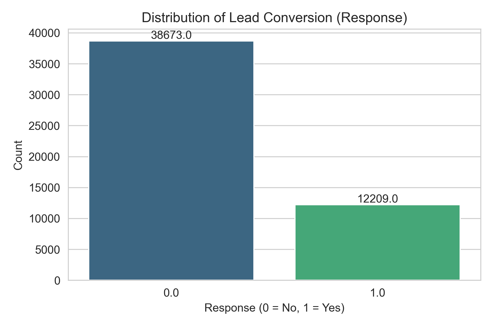
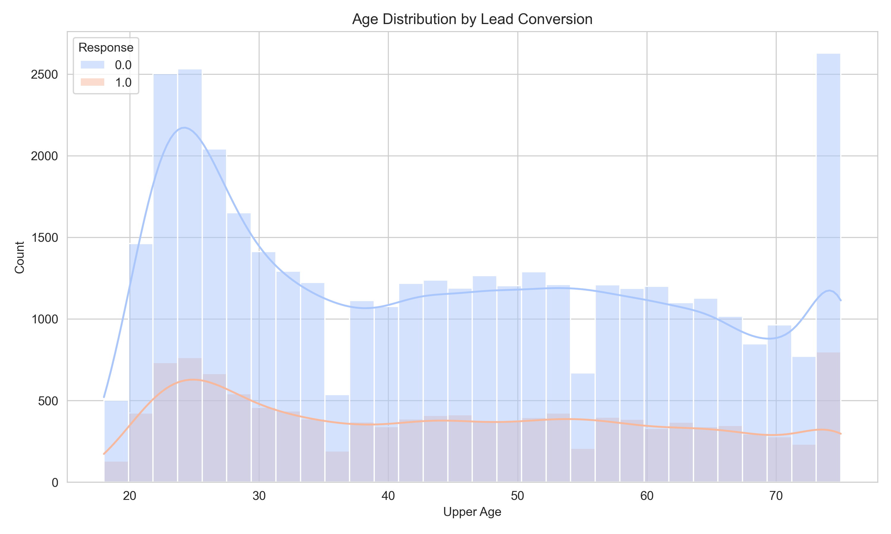
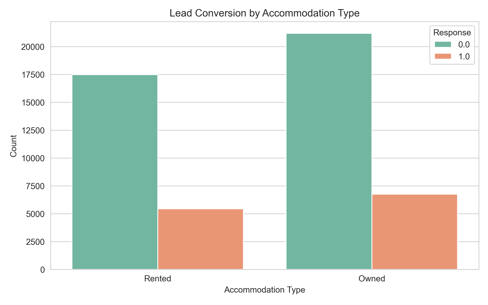
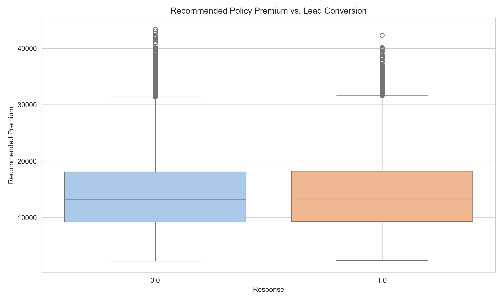
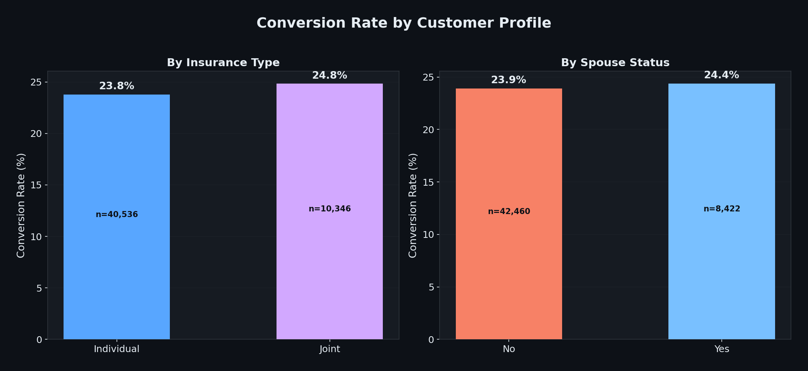
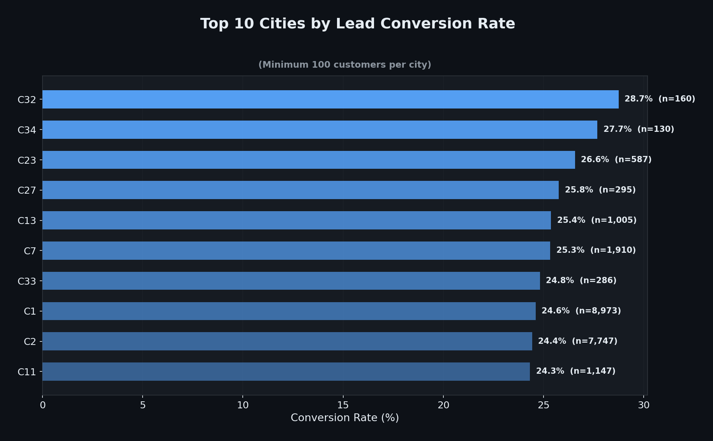
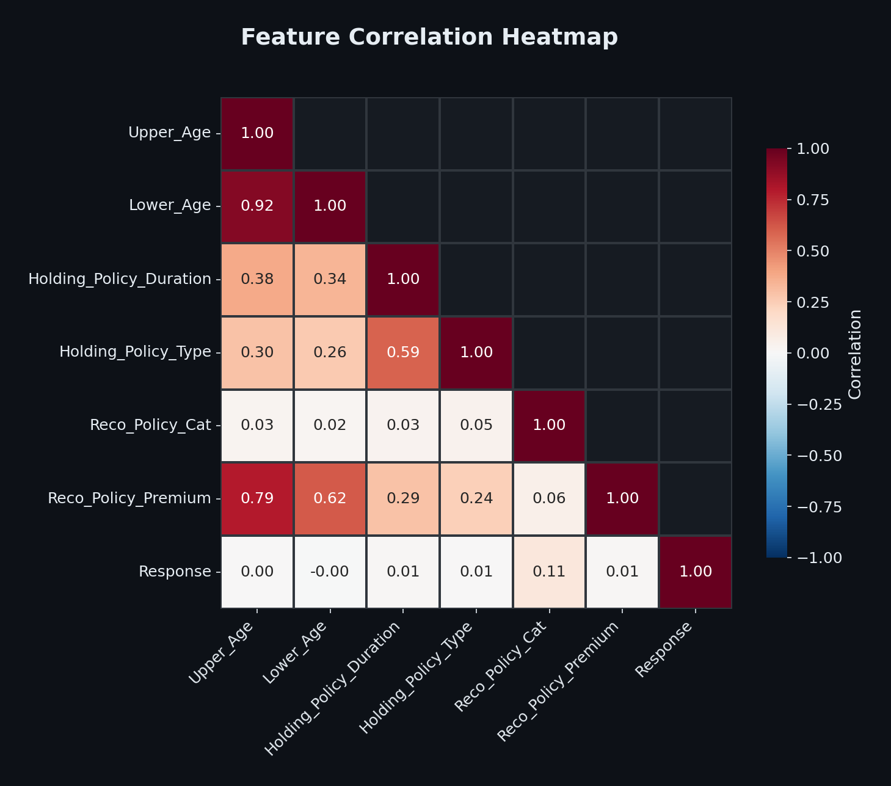
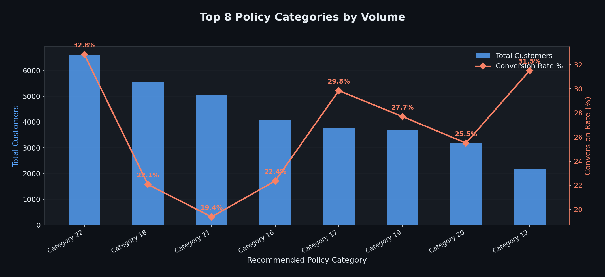
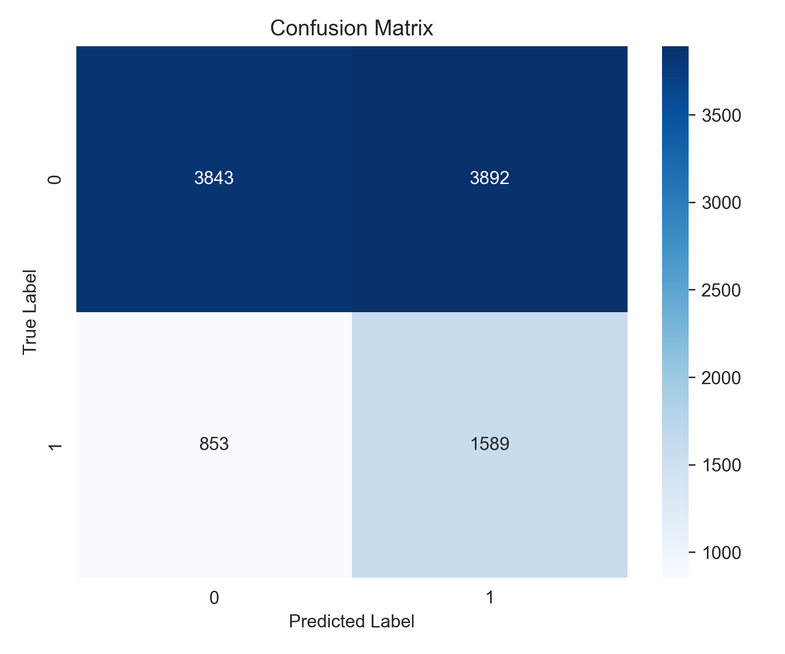
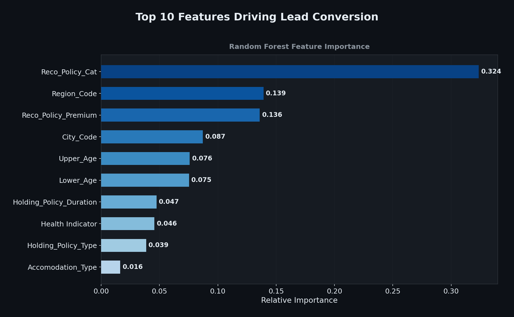

# Health Insurance Lead Prediction Analysis

## Table of Contents
- [Project Background](#project-background)
- [Executive Summary](#executive-summary)
- [Insights Deep-Dive](#insights-deep-dive)
    - [Lead Conversion Funnel](#lead-conversion-funnel)
    - [Demographic Trends & Age Impact](#demographic-trends--age-impact)
    - [Accommodation & Premium Impact](#accommodation--premium-impact)
    - [Customer Profile Segmentation](#customer-profile-segmentation)
    - [Regional Performance](#regional-performance)
    - [Feature Correlations](#feature-correlations)
- [Predictive Modeling](#predictive-modeling)
    - [Model Performance](#model-performance)
    - [Key Drivers of Conversion](#key-drivers-of-conversion)
- [Recommendations](#recommendations)
- [Assumptions and Caveats](#assumptions-and-caveats)

---

## Project Background

A leading health insurance provider generates thousands of customer leads through multiple channels. However, the sales team faces a critical challenge: **only ~24% of leads convert into actual policy purchases**, resulting in wasted marketing spend and inefficient outreach. 

As a data analyst partnering with the marketing and product strategy teams, I was tasked with analyzing 50,000+ customer records to identify the demographic, behavioral, and policy-related factors that most strongly predict a customer's likelihood to respond positively to a health insurance offer. The ultimate goal is to **optimize marketing spend, improve lead scoring, and increase conversion rates** through data-driven targeting.

**Core Data Analytics Stack:**
- **Dataset**: 50,882 customer records with 14 features including demographics, policy details, and response status
- **SQL**: Exploratory queries for initial data profiling and segmentation analysis
- **Python**: Pandas, Matplotlib, and Seaborn for Data Cleaning, EDA, and statistical analysis

**Bonus Exploration:**
- **Machine Learning**: Scikit-learn (Random Forest Classifier) for an introductory exploration of predictive lead scoring. Note: As my core focus is Data Analytics, I utilized an AI coding assistant (LLM) to help write the Python ML implementation.

---

## Executive Summary

Analysis of **50,882 customer records** reveals a baseline conversion rate of **24.0%**, with **12,209 positive leads** against **38,673 negative leads**. The data uncovers several actionable patterns:

- **Age is not a simple linear predictor**: The 36-45 age group has the highest conversion rate (25.1%), not the oldest demographic as initially hypothesized. The youngest group (18-25) has the lowest at 22.7%.
- **Policy category is the #1 driver**: `Reco_Policy_Cat` dominates feature importance at 32.4%, far outweighing all other features. This suggests the *type of policy recommended* matters more than customer demographics.
- **Geographic concentration**: Cities C1 and C2 alone account for ~33% of all leads. Top-performing cities like C32 achieve 28.7% conversion, while underperforming cities fall below 20%.
- **Premium pricing sweet spot**: The premium distribution between interested and non-interested customers is nearly identical, suggesting premium amount alone is not a barrier — but the policy-premium *match* to customer profile may be.
- **Accommodation type has minimal impact**: Owned vs. Rented accommodation shows only a ~1 percentage point difference in conversion (24.1% vs 23.8%), debunking the assumption that homeowners convert at significantly higher rates.

---

## Insights Deep-Dive

### Lead Conversion Funnel
The overall lead conversion rate stands at **24.0%** — meaning roughly 1 in 4 prospects converts into a policy holder. While this is a healthy baseline for insurance marketing, **76% of leads remain untapped**, representing a massive revenue opportunity if even a small fraction can be converted through better targeting.

| Metric | Value |
|--------|-------|
| Total Records | 50,882 |
| Positive Leads (Interested) | 12,209 (24.0%) |
| Negative Leads (Not Interested) | 38,673 (76.0%) |

---

### Demographic Trends & Age Impact
Contrary to common assumptions, **age does not follow a simple linear relationship** with conversion. The data reveals a bell-curve pattern:

- **18-25 age group**: Lowest conversion at **22.7%** — younger customers may lack financial motivation for health insurance
- **26-35 age group**: Sharp increase to **24.6%** — career-establishment phase drives health awareness
- **36-45 age group**: **Peak conversion at 25.1%** — family responsibility and health concerns drive purchases
- **46+ age groups**: Slight decline to ~23.8-23.9% — potentially already insured or price-sensitive

---

### Accommodation & Premium Impact

**Accommodation Type** shows a surprisingly small effect on conversion:
- **Owned**: 24.1% conversion rate (n=27,000+)
- **Rented**: 23.8% conversion rate (n=23,000+)

This near-parity suggests that accommodation type alone should not be a primary segmentation criterion for marketing campaigns.

**Premium Distribution** analysis reveals that interested and non-interested customers receive nearly identical premium recommendations, suggesting the *amount* isn't the barrier — rather, the *fit* between policy type and customer needs matters more.

---

### Customer Profile Segmentation

Breaking down conversion by insurance type and spouse status reveals nuanced patterns:

- **Individual vs. Joint policies**: Conversion rates differ by insurance type, indicating that policy structure affects customer decision-making
- **Spouse presence**: Customers identified as spouses show different conversion patterns, suggesting that household dynamics play a role in insurance purchase decisions

---

### Regional Performance

Geographic analysis filtered to cities with 100+ customers reveals significant variation:

- **Top performer**: City C32 achieves **28.7% conversion** — a full 4.7 percentage points above baseline
- **Volume leaders**: Cities C1 (n=8,973) and C2 (n=7,747) maintain solid ~24.5% conversion at massive scale
- **The spread**: A 4+ percentage point gap between top and bottom cities suggests regional marketing strategies could be highly effective

---

### Feature Correlations

The correlation heatmap reveals important structural relationships in the data:

- **Upper_Age and Lower_Age** are highly correlated (0.92), suggesting one may be redundant for modeling
- **Reco_Policy_Premium and Upper_Age** show strong correlation (0.79), confirming that older customers receive higher premium recommendations
- **Response has weak linear correlation** with all individual features (max 0.11 with `Reco_Policy_Cat`), indicating that conversion is driven by **non-linear interactions** — justifying the use of ensemble ML models

---

### Policy Category Performance

Not all policy categories perform equally:

- Certain categories attract significantly more customers but may not have the highest conversion rates
- The interplay between volume and conversion rate reveals which categories are over-marketed vs. under-marketed

---

## Predictive Modeling (Bonus Exploration)

While my primary focus as a Data Analyst was to uncover actionable business insights through EDA and statistical analysis, I wanted to explore the predictive power of this dataset. Since my core expertise is in Analytics rather than Machine Learning, I utilized an AI coding assistant to help write the `scikit-learn` Python code for this section.

A **Random Forest Classifier** was built to predict lead conversion probability. The model was trained on 80% of the data (40,705 records) and evaluated on a held-out 20% test set (10,177 records).

### Model Performance

| Metric | Not Interested (0) | Interested (1) |
|--------|-------------------|-----------------|
| Precision | 0.81 | 0.30 |
| Recall | 0.58 | 0.56 |
| F1-Score | 0.68 | 0.39 |
| **ROC-AUC** | **0.6222** | |

The model achieves a **ROC-AUC of 0.6222**, indicating moderate discriminatory power. The class imbalance (76:24 split) makes this a challenging prediction problem, and the model correctly identifies **56% of actual interested customers** (recall for class 1).

### Key Drivers of Conversion

Feature importance analysis from the Random Forest model reveals the **top predictors of lead conversion**:

| Rank | Feature | Importance | Insight |
|------|---------|-----------|---------|
| 1 | `Reco_Policy_Cat` | 0.324 | The recommended policy category is by far the strongest predictor |
| 2 | `Region_Code` | 0.139 | Geographic location significantly influences conversion |
| 3 | `Reco_Policy_Premium` | 0.136 | Premium amount plays a key role in purchase decisions |
| 4 | `City_Code` | 0.087 | City-level variation captures local market dynamics |
| 5 | `Upper_Age` | 0.076 | Age remains a meaningful demographic predictor |

The dominance of `Reco_Policy_Cat` (32.4% importance) suggests that **recommending the right policy category** is more impactful than any demographic or pricing factor.

---

## Recommendations

### Optimize Policy Recommendations
- **Personalize policy category matching**: Since `Reco_Policy_Cat` is the #1 predictor (32.4% importance), invest in a recommendation engine that matches customers to optimal policy categories based on their profile — this alone could meaningfully lift conversion.
- **A/B test policy presentations**: Test different ways of presenting policy options to prospects to find the framing that maximizes conversion.

### Targeted Regional Strategies
- **Double down on high-converting cities**: Cities like C32 (28.7%) and C34 (27.7%) significantly outperform baseline. Analyze what makes these markets successful and replicate those strategies.
- **Investigate underperforming regions**: Some regions fall well below the 24% baseline. Conduct market research to understand barriers and tailor campaigns accordingly.

### Demographic-Based Campaigns
- **Focus on the 26-45 "sweet spot"**: This age range shows the highest conversion rates (24.6-25.1%). Create targeted content addressing their specific concerns: family health, career protection, and long-term financial planning.
- **Re-engage the 18-25 segment**: The youngest group has the lowest conversion (22.7%). Consider entry-level products, educational content about insurance value, or employer-partnership channels to reach this demographic.

### Premium Strategy Refinement
- **Develop tiered pricing models**: While premium amount alone doesn't predict conversion, the interaction between premium and policy category does. Create transparent pricing tiers that customers can easily compare.
- **Bundle complementary products**: Offer add-ons to existing policyholders at attractive rates to increase customer lifetime value.

### Model Improvement Opportunities
- **Address class imbalance**: Apply techniques like SMOTE oversampling or cost-sensitive learning to improve recall for the minority class (interested customers).
- **Feature engineering**: Create interaction features (e.g., Age x Policy_Cat, Region x Premium) to capture the non-linear relationships identified in the correlation analysis.
- **Ensemble stacking**: Combine Random Forest with Gradient Boosting and Logistic Regression in a stacking ensemble for improved ROC-AUC.

---

## Assumptions and Caveats

- **Data Cleaning**: An outlier value of `12200.0` was found in the `Response` target variable and dropped to maintain strict binary classification (0 or 1). Two empty columns (`Column1`, `Unnamed: 15`) were also removed.
- **Missing Value Imputation**: Missing values in `Health Indicator` were imputed with the mode, and `Holding_Policy_Duration` missing values were set to 0 (assuming no prior policy).
- **Feature Engineering**: City codes and region codes were label-encoded for modeling. While this preserves information, it introduces an artificial ordinal relationship that tree-based models handle reasonably well but linear models would not.
- **Class Imbalance**: The 76:24 split between negative and positive responses inherently favors the majority class. The `class_weight='balanced'` parameter was used during model training to partially address this, but further techniques (SMOTE, threshold tuning) could improve minority class performance.
- **Temporal Data**: The dataset lacks timestamps, preventing temporal analysis of conversion trends, seasonality, or cohort effects.

---

See my SQL queries in the [SQL file](sql/health_insurance_queries.sql).  
See the notebooks for data cleaning, visualization, and analysis in the [EDA Notebook](notebooks/01_data_cleaning_and_eda.ipynb) and [Modeling Notebook](notebooks/02_predictive_modeling.ipynb).
